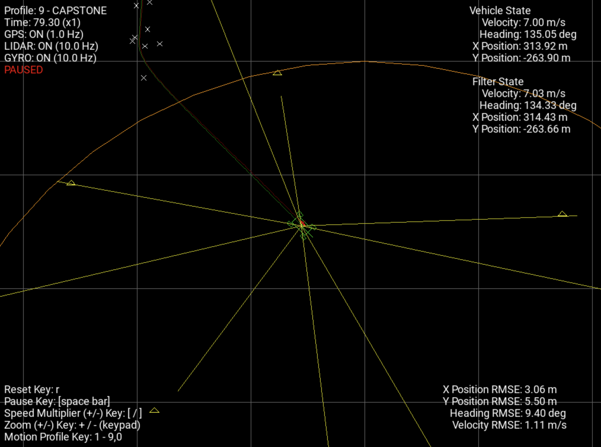

# Capstone Project: Vehicle State Estimation

This project implements a Kalman filter-based vehicle state estimation system that fuses data from multiple sensors (
GPS, LIDAR, and gyroscope) to accurately track a vehicle's position, orientation, velocity, and gyroscope bias.

## Demonstration



The picture shows the Kalman filter in real-time operation, tracking vehicle position and orientation while fusing
GPS, LIDAR, and gyroscope data. The ellipse represents position uncertainty, which typically shrinks as the filter
incorporates more measurements.

## Features

- **Unscented Kalman Filter** implementation for handling nonlinear motion and measurement models
- **Multi-sensor fusion** combining:
    - GPS position measurements
    - LIDAR range and bearing measurements to beacons
    - Gyroscope angular velocity measurements
- **Gyroscope bias estimation** to compensate for sensor drift
- **Chi-square validation gates** (95% confidence) to reject outlier measurements
- **Robust initialization** using multiple sensor measurements
- **Visualization** of vehicle state and estimation uncertainty

## Prerequisites

- C++14 compatible compiler
- CMake 3.10+
- Eigen 3.3+ (linear algebra library)
- Boost (for chi-squared distribution calculations)
- SDL2 and SDL2_ttf (for visualization)

## Build Instructions

```bash
# Clone the repository
git clone https://github.com/javamercy/CapstoneProject
cd CapstoneProject

# Create build directory
mkdir build && cd build

# Configure and build
cmake ..
make

# Run the executable
./Capstone
```

## Technical Implementation

### State Vector

The filter maintains a 5-dimensional state vector:

```
X = [x, y, ψ, v, b]
```

Where:

- `x, y`: Vehicle position
- `ψ`: Vehicle heading angle
- `v`: Vehicle velocity
- `b`: Gyroscope measurement bias

### Sensor Models

- **GPS**: Direct observation of vehicle position (x,y)
- **LIDAR**: Range and bearing to known beacon positions
- **Gyroscope**: Angular velocity measurements (with bias)

### Key Components

- `KalmanFilter`: Main class implementing the filter
- `vehicleProcessModel`: Propagates vehicle state using motion model
- `lidarMeasurementModel`: Converts vehicle state to expected LIDAR measurements
- `chiSquareTest`: Statistical validation of measurements
- `generateSigmaPoints`: Creates sigma points for unscented transform
- `normaliseState`: Handles angle wrapping in state vector

## Project Structure

- `src/capstone.h/cpp`: Main Kalman filter implementation
- `src/sensors.h/cpp`: Sensor measurement classes
- `src/beacons.h/cpp`: Beacon map definition and handling
- `src/display.cpp`: Visualization components
- `src/simulation.cpp`: Simulation environment
- `src/utils.cpp`: Utility functions including angle wrapping
- `src/main.cpp`: Program entry point

## Usage

The system initializes when it receives sufficient GPS and LIDAR measurements, then continuously updates its state
estimate as new measurements arrive. The visualization shows the vehicle position, orientation, and uncertainty ellipse.

## Parameters

Key filter parameters can be adjusted in `capstone.cpp`:

- Measurement noise standard deviations
- Process noise parameters
- Chi-square test confidence level (95% default)
- Initialization settings

## Acknowledgments

This project was developed based on teachings by **Steven Dumble**. For more information and related resources, visit
his
website at [technitute.io](https://www.technitute.io/) or his GitHub profile
at [github.com/technitute](https://github.com/technitute).
